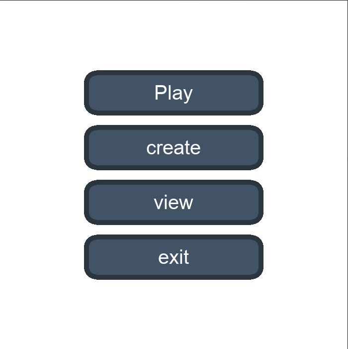
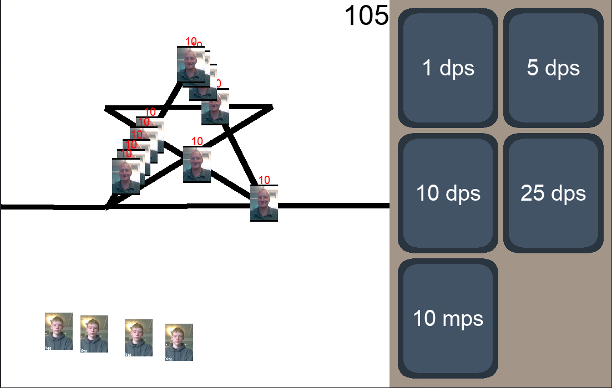
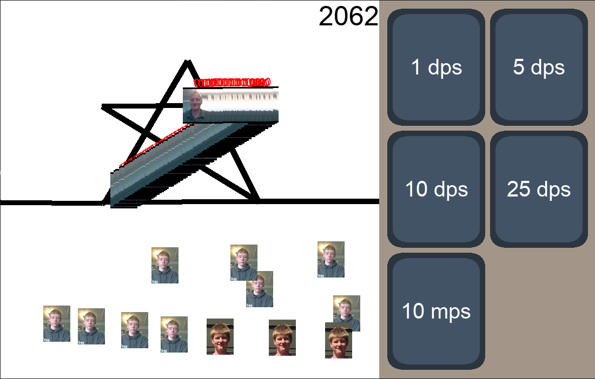
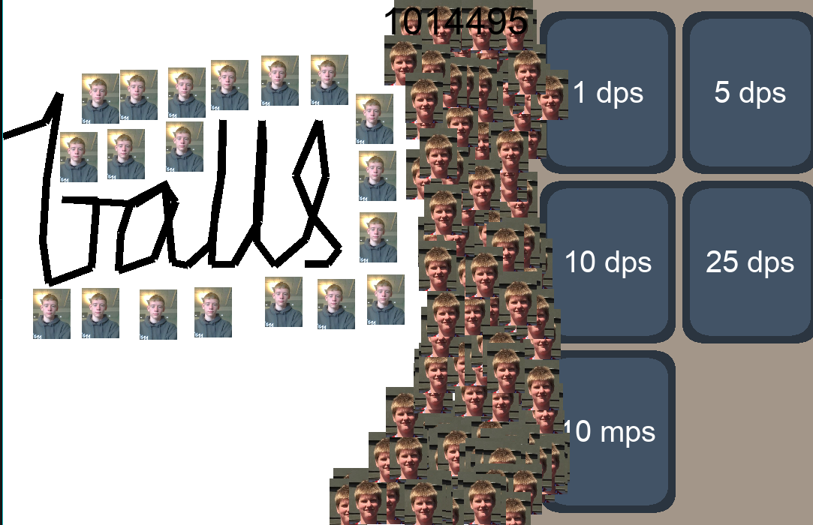

# Obel2d

Obel2d is a tower defense game made **entirely** in sdl2.

I use [this json parser](https://github.com/nlohmann/json) for writing map data to json.
It is very easy to use.

## table of contents
* [obel](#obel)
* [installation](#installation)
    * [Linux](#linux)
    * [windows](#windows)
    * [mac](#mac)
* [reviews](#reviews)
* [Screenshots](#screenshots)

## obel
  
*Obel- the greatest man there ever was*

&nbsp;

Obel was a great person  
He was always there for me  
He was my best friend  
And I will never forget him

*-open ai*

## installation
### linux
**requirements:**
* sdl2
* sdl2_image
* sdl2_ttf
* sdl2_gfx
* g++ (or any other c++ compiler)

arch:
```
pacman -S sdl2 sdl2_image sdl2_ttf sdl2_gfx gcc
```

Clone the source code and build:

```
g++ main.cpp --std=c++20 -lSDL2 -lSDL2_ttf -lSDL2_gfx -lSDL2_image -o main
```

### windows
Download the latest release from [the releases page](https://github.com/mativ123/obel2d/releases).

### mac
you are on your own.

## reviews
Obel2D is one of the most addicting games I have ever played. I love the puzzles and the challenge it provides. I have never been able to put it down for more than a few minutes.  
*-open ai*
## screenshots




